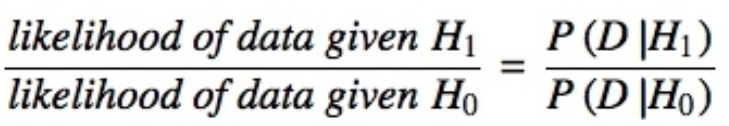
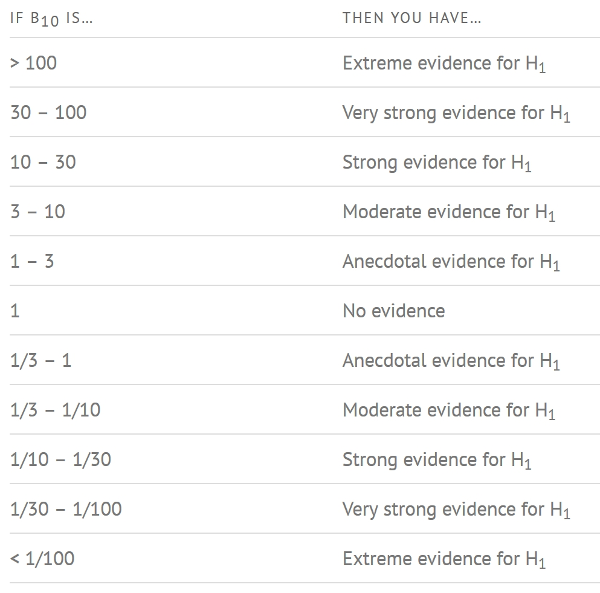
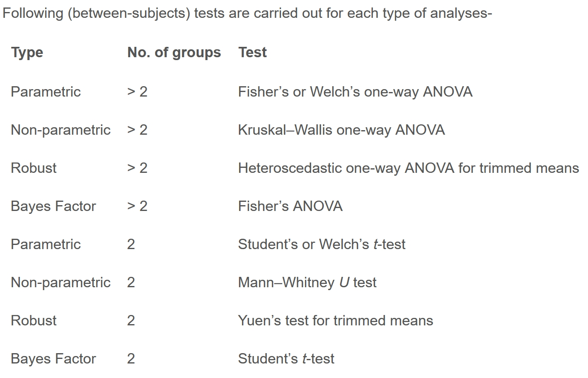
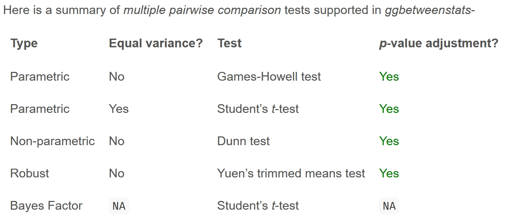
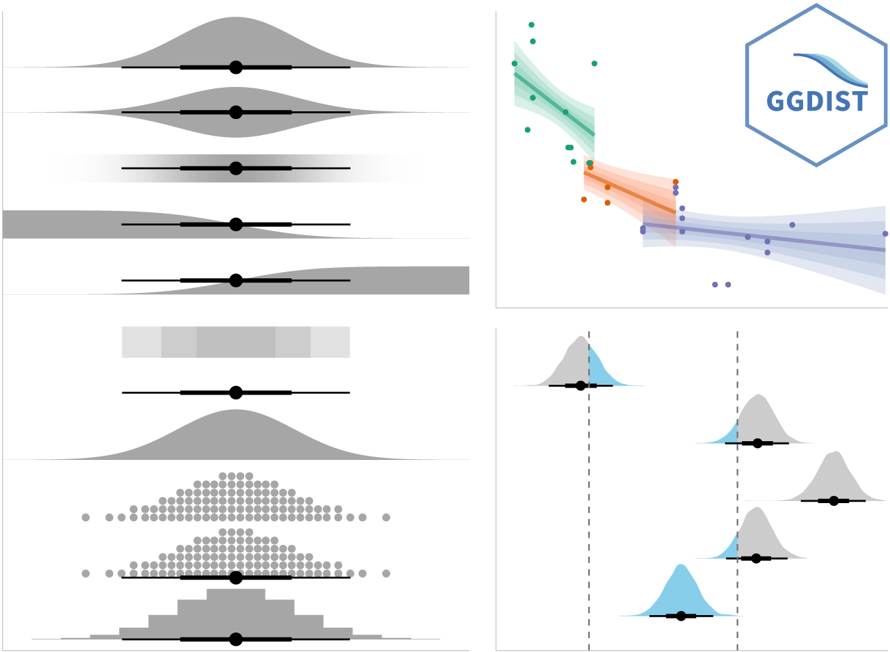

# 1. Visualizing Distribution

## 1.1 Learning Outcome

Visualizing distribution is not new in statistical analysis. In chapter 1 we have shared with you some of the popular statistical graphics methods for visualising distribution are histogram, probability density curve (pdf), boxplot, notch plot and violin plot and how they can be created by using ggplot2. In this chapter, we are going to share with you two relatively new statistical graphic methods for visualising distribution, namely ridgeline plot and raincloud plot by using ggplot2 and its extensions.

## 1.2 Getting Started

### 1.2.1 Installing and loading the packages

For the purpose of this exercise, the following R packages will be used, they are:

-   ggridges, a ggplot2 extension specially designed for plotting ridgeline plots,

-   ggdist, a ggplot2 extension spacially desgin for visualizing distribution and uncertainty,

-   tidyverse, a family of R packages to meet the modern data science and visual communication needs,

-   ggthemes, a ggplot extension that provides the user additional themes, scales, and geoms for the ggplots package, and

-   colorspace, an R package provides a broad toolbox for selecting individual colors or color palettes, manipulating these colors, and employing them in various kinds of visualisations.

The code chunk below will be used load these R packages into RStudio environment.

```{r}
pacman::p_load(ggdist, ggridges, ggthemes,
               colorspace, tidyverse) 
```

### 1.2.2 Data import

For the purpose of this exercise, Exam_data.csv will be used.

In the code chunk below, read_csv() of readr package is used to import Exam_data.csv into R and saved it into a tibble data.frame.

```{r}
exam <- read_csv("data/Exam_data.csv")
```

## 1.3 Visualizing Distribution with Ridgeline Plot

[*Ridgeline plot*](https://www.data-to-viz.com/graph/ridgeline.html) (sometimes called *Joyplot*) is a data visualisation technique for revealing the distribution of a numeric value for several groups. Distribution can be represented using histograms or density plots, all aligned to the same horizontal scale and presented with a slight overlap.

> **Note**
>
> -   Ridgeline plots make sense when the number of groups to represent is medium to high, and thus a classic window separation would take too much space. Indeed, the fact that groups overlap each other allows to use space more efficiently. If you have less than 5 groups, dealing with other distribution plots is probably better.
>
> -   It works well when there is a clear pattern in the result, like if there is an obvious ranking in groups. Otherwise, groups will tend to overlap each other, leading to a messy plot not providing any insight.

### 1.3.1 Plotting ridgeline graph: ggridges method

There are several ways to plot ridgeline plot with R. In this section, you will learn how to plot ridgeline plot by using [ggridges](https://wilkelab.org/ggridges/index.html) package.

ggridges package provides two main geom to plot gridgeline plots, they are: [`geom_ridgeline()`](https://wilkelab.org/ggridges/reference/geom_ridgeline.html) and [`geom_density_ridges()`](https://wilkelab.org/ggridges/reference/geom_density_ridges.html). The former takes height values directly to draw the ridgelines, and the latter first estimates data densities and then draws those using ridgelines.

The ridgeline plot below is plotted by using `geom_density_ridges()`.

```{r}
ggplot(exam, 
       aes(x = ENGLISH, 
           y = CLASS)) +
  geom_density_ridges(
    scale = 3,
    rel_min_height = 0.01,
    bandwidth = 3.4,
    fill = lighten("#7097BB", .3),
    color = "white"
  ) +
  scale_x_continuous(
    name = "English grades",
    expand = c(0, 0)
    ) +
  scale_y_discrete(name = NULL, expand = expansion(add = c(0.2, 2.6))) +
  theme_ridges()
```

### 1.3.2 Varying fill colors along the x axis

Sometimes we would like to have the area under a ridgeline not filled with a single solid color but rather with colors that vary in some form along the x axis. This effect can be achieved by using either [`geom_ridgeline_gradient()`](https://wilkelab.org/ggridges/reference/geom_ridgeline_gradient.html) or [`geom_density_ridges_gradient()`](https://wilkelab.org/ggridges/reference/geom_ridgeline_gradient.html). Both geoms work just like `geom_ridgeline()` and `geom_density_ridges()`, except that they allow for varying fill colors. However, they do not allow for alpha transparency in the fill. For technical reasons, we can have changing fill colors or transparency but not both.

```{r}
ggplot(exam, 
       aes(x = ENGLISH, 
           y = CLASS,
           fill = stat(x))) +
  geom_density_ridges_gradient(
    scale = 3,
    rel_min_height = 0.01) +
  scale_fill_viridis_c(name = "Temp. [F]",
                       option = "C") +
  scale_x_continuous(
    name = "English grades",
    expand = c(0, 0)
  ) +
  scale_y_discrete(name = NULL, expand = expansion(add = c(0.2, 2.6))) +
  theme_ridges()
```

```{r}
ggplot(exam, 
       aes(x = ENGLISH, 
           y = CLASS,
           fill = stat(x))) +
  geom_density_ridges_gradient(
    scale = 3,
    rel_min_height = 0.01,
    color='#8da3ca',
    linewidth=1.05) +
  scale_color_continuous_sequential('Purple-Blue')+
  scale_fill_continuous_sequential('Purple-Blue', name='displ')+
  scale_x_continuous(
    expand = c(0, 0)
  ) +
  scale_y_discrete(name = NULL, expand = expansion(add = c(0.2, 2.6))) +
  theme_ridges()+
  labs(x = "English Score",
       y = "",
       title="Colour transition from light to dark as scores improve.") +   
  theme(
    legend.position = "none",
    #panel.grid.major = element_blank(),
    axis.title.y = element_blank(),
    plot.background = element_rect(fill="#f5f5f5",colour="#f5f5f5")  
    )  
```

### 1.3.3 Mapping the probabilities directly onto colour

Beside providing additional geom objects to support the need to plot ridgeline plot, ggridges package also provides a stat function called [`stat_density_ridges()`](https://wilkelab.org/ggridges/reference/stat_density_ridges.html) that replaces [`stat_density()`](https://ggplot2.tidyverse.org/reference/geom_density.html) of ggplot2.

Figure below is plotted by mapping the probabilities calculated by using `stat(ecdf)` which represent the empirical cumulative density function for the distribution of English score.

```{r}
ggplot(exam,
       aes(x = ENGLISH, 
           y = CLASS, 
           fill = 0.5 - abs(0.5-stat(ecdf)))) +
  stat_density_ridges(geom = "density_ridges_gradient", 
                      calc_ecdf = TRUE) +
  scale_fill_viridis_c(name = "Tail probability",
                       direction = -1) +
  theme_ridges()
```

> **Important**
>
> It is important include the argument calc_ecdf = TRUE in stat_density_ridges().

### 1.3.4 Ridgeline plots with quantile lines

By using [`geom_density_ridges_gradient()`](https://wilkelab.org/ggridges/reference/geom_ridgeline_gradient.html), we can colour the ridgeline plot by quantile, via the calculated `stat(quantile)` aesthetic as shown in the figure below.

```{r}
ggplot(exam,
       aes(x = ENGLISH, 
           y = CLASS, 
           fill = factor(stat(quantile))
           )) +
  stat_density_ridges(
    geom = "density_ridges_gradient",
    calc_ecdf = TRUE, 
    quantiles = 4,
    quantile_lines = TRUE) +
  scale_fill_viridis_d(name = "Quartiles") +
  theme_ridges()
```

Instead of using number to define the quantiles, we can also specify quantiles by cut points such as 2.5% and 97.5% tails to colour the ridgeline plot as shown in the figure below.

```{r}
ggplot(exam,
       aes(x = ENGLISH, 
           y = CLASS, 
           fill = factor(stat(quantile))
           )) +
  stat_density_ridges(
    geom = "density_ridges_gradient",
    calc_ecdf = TRUE, 
    quantiles = c(0.025, 0.975)
    ) +
  scale_fill_manual(
    name = "Probability",
    values = c("#FF0000A0", "#A0A0A0A0", "#0000FFA0"),
    labels = c("(0, 0.025]", "(0.025, 0.975]", "(0.975, 1]")
  ) +
  theme_ridges()
```

## 1.4 Visualizing Distribution with Raincloud Plot

Raincloud Plot is a data visualisation techniques that produces a half-density to a distribution plot. It gets the name because the density plot is in the shape of a “raincloud”. The raincloud (half-density) plot enhances the traditional box-plot by highlighting multiple modalities (an indicator that groups may exist). The boxplot does not show where densities are clustered, but the raincloud plot does!

In this section, you will learn how to create a raincloud plot to visualise the distribution of English score by race. It will be created by using functions provided by **ggdist** and ggplot2 packages.

### 1.4.1 Plotting a Half Eye graph

First, we will plot a Half-Eye graph by using [`stat_halfeye()`](https://mjskay.github.io/ggdist/reference/stat_halfeye.html) of **ggdist** package.

```{r}
ggplot(exam, 
       aes(x = RACE, 
           y = ENGLISH)) +
  stat_halfeye(adjust = 0.5,
               justification = -0.2,
               .width = 0,
               point_colour = NA)
```

This produces a Half Eye visualization, which is contains a half-density and a slab-interval.

### 1.4.2 Adding the boxplot with geom_boxplot()

Next, we will add the second geometry layer using [`geom_boxplot()`](https://r4va.netlify.app/chap09) of ggplot2. This produces a narrow boxplot. We reduce the width and adjust the opacity.

```{r}
ggplot(exam, 
       aes(x = RACE, 
           y = ENGLISH)) +
  stat_halfeye(adjust = 0.5,
               justification = -0.2,
               .width = 0,
               point_colour = NA) +
  geom_boxplot(width = .20,
               outlier.shape = NA)
```

### 1.4.3 Adding the Dot Plots with stat_dots()

Next, we will add the third geometry layer using [`stat_dots()`](https://mjskay.github.io/ggdist/reference/stat_dots.html) of ggdist package. This produces a half-dotplot, which is similar to a histogram that indicates the number of samples (number of dots) in each bin. We select side = “left” to indicate we want it on the left-hand side.

```{r}
ggplot(exam, 
       aes(x = RACE, 
           y = ENGLISH)) +
  stat_halfeye(adjust = 0.5,
               justification = -0.2,
               .width = 0,
               point_colour = NA) +
  geom_boxplot(width = .20,
               outlier.shape = NA) +
  stat_dots(side = "left", 
            justification = 1.2, 
            binwidth = .5,
            dotsize = 2)
```

### 1.4.4 Finishing touch

Lastly, [`coord_flip()`](https://ggplot2.tidyverse.org/reference/coord_flip.html) of ggplot2 package will be used to flip the raincloud chart horizontally to give it the raincloud appearance. At the same time, `theme_economist()` of ggthemes package is used to give the raincloud chart a professional publishing standard look.

```{r}
ggplot(exam, 
       aes(x = RACE, 
           y = ENGLISH)) +
  stat_halfeye(adjust = 0.5,
               justification = -0.2,
               .width = 0,
               point_colour = NA) +
  geom_boxplot(width = .20,
               outlier.shape = NA) +
  stat_dots(side = "left", 
            justification = 1.2, 
            binwidth = .5,
            dotsize = 1.5) +
  coord_flip() +
  theme_economist()
```

# 2. Visual Statistical Analysis

## 2.1 Learning Outcome

In this hands-on exercise, you will gain hands-on experience on using:

-   ggstatsplot package to create visual graphics with rich statistical information,

-   performance package to visualize model diagnostics, and

-   parameters package to visualize model parameters

## 2.2 Visual Statistical Analysis with ggstatsplot

[**ggstatsplot**](https://indrajeetpatil.github.io/ggstatsplot/index.html) is an extension of [**ggplot2**](https://ggplot2.tidyverse.org/) package for creating graphics with details from statistical tests included in the information-rich plots themselves.


## 2.3 Getting Started

### 2.3.1 Installing and launching R packages

In this exercise, **ggstatsplot** and **tidyverse** will be used.

```{r}
pacman::p_load(ggstatsplot, tidyverse)
```

### 2.3.2 Importing data

```{r}
exam <- read_csv("data/Exam_data.csv")
```

### 2.3.3 One-sample test: gghistostats() method

In the code chunk below, [*gghistostats()*](https://indrajeetpatil.github.io/ggstatsplot/reference/gghistostats.html) is used to to build an visual of one-sample test on English scores.

```{r}
set.seed(1234)

gghistostats(
  data = exam,
  x = ENGLISH,
  type = "bayes",
  test.value = 60,
  xlab = "English scores"
)
```

Default information: - statistical details - Bayes Factor - sample sizes - distribution summary

### 2.3.4 Unpacking the Bayes Factor

-   A Bayes factor is the ratio of the likelihood of one particular hypothesis to the likelihood of another. It can be interpreted as a measure of the strength of evidence in favor of one theory among two competing theories.

-   That’s because the Bayes factor gives us a way to evaluate the data in favor of a null hypothesis, and to use external information to do so. It tells us what the weight of the evidence is in favor of a given hypothesis.

-   When we are comparing two hypotheses, H1 (the alternate hypothesis) and H0 (the null hypothesis), the Bayes Factor is often written as B10. It can be defined mathematically as

{width="401"}

-   The [**Schwarz criterion**](https://www.statisticshowto.com/bayesian-information-criterion/) is one of the easiest ways to calculate rough approximation of the Bayes Factor.

### 2.3.5 How to interpret Bayes Factor

A **Bayes Factor** can be any positive number. One of the most common interpretations is this one—first proposed by Harold Jeffereys (1961) and slightly modified by [Lee and Wagenmakers](https://www-tandfonline-com.libproxy.smu.edu.sg/doi/pdf/10.1080/00031305.1999.10474443?needAccess=true) in 2013:

{width="450"}

### 2.3.6 Two-sample mean test: ggbetweenstats()

In the code chunk below, [*ggbetweenstats()*](https://indrajeetpatil.github.io/ggstatsplot/reference/ggbetweenstats.html) is used to build a visual for two-sample mean test of Maths scores by gender.

```{r}
ggbetweenstats(
  data = exam,
  x = GENDER, 
  y = MATHS,
  type = "np",
  messages = FALSE
)
```

Default information: - statistical details - Bayes Factor - sample sizes - distribution summary

### 2.3.7 Oneway ANOVA Test: ggbetweenstats() method

In the code chunk below, [*ggbetweenstats()*](https://indrajeetpatil.github.io/ggstatsplot/reference/ggbetweenstats.html) is used to build a visual for One-way ANOVA test on English score by race.

```{r}
ggbetweenstats(
  data = exam,
  x = RACE, 
  y = ENGLISH,
  type = "p",
  mean.ci = TRUE, 
  pairwise.comparisons = TRUE, 
  pairwise.display = "s",
  p.adjust.method = "fdr",
  messages = FALSE
)
```

-   “ns” → only non-significant

-   “s” → only significant

-   “all” → everything

{width="601"}


{width="637"}

### 2.3.8 Significant Test of Correlation: ggscatterstats()

In the code chunk below, [*ggscatterstats()*](https://indrajeetpatil.github.io/ggstatsplot/reference/ggscatterstats.html) is used to build a visual for Significant Test of Correlation between Maths scores and English scores.

```{r}
ggscatterstats(
  data = exam,
  x = MATHS,
  y = ENGLISH,
  marginal = FALSE,
  )
```

### 2.3.9 Significant Test of Association (Depedence) : ggbarstats() methods

In the code chunk below, the Maths scores is binned into a 4-class variable by using cut().

```{r}
exam1 <- exam %>% 
  mutate(MATHS_bins = 
           cut(MATHS, 
               breaks = c(0,60,75,85,100))
)
```

In this code chunk below [*ggbarstats()*](https://indrajeetpatil.github.io/ggstatsplot/reference/ggbarstats.html) is used to build a visual for Significant Test of Association

```{r}
ggbarstats(exam1, 
           x = MATHS_bins, 
           y = GENDER)
```

# 3. Visualizing Uncertainty

## 3.1 Learning Outcome

Visualizing uncertainty is relatively new in statistical graphics. In this chapter, you will gain hands-on experience on creating statistical graphics for visualizing uncertainty. By the end of this chapter you will be able:

-   to plot statistics error bars by using ggplot2,

-   to plot interactive error bars by combining ggplot2, plotly and DT,

-   to create advanced by using ggdist, and

-   to create hypothetical outcome plots (HOPs) by using ungeviz package.

## 3.2 Getting Started

### 3.2.1 Installing and loading the packages

For the purpose of this exercise, the following R packages will be used, they are:

-   tidyverse, a family of R packages for data science process,

-   plotly for creating interactive plot,

-   gganimate for creating animation plot,

-   DT for displaying interactive html table,

-   crosstalk for for implementing cross-widget interactions (currently, linked brushing and filtering), and

-   ggdist for visualizing distribution and uncertainty.

```{r}
pacman::p_load(plotly, crosstalk, DT, 
               ggdist, ggridges, colorspace,
               gganimate, tidyverse)
```

### 3.2.2 Data import

For the purpose of this exercise, *Exam_data.csv* will be used.

```{r}
exam <- read_csv("data/Exam_data.csv")
```

## 3.3 Visualizing the uncertainty of point estimates: ggplot2 methods

A point estimate is a single number, such as a mean. Uncertainty, on the other hand, is expressed as standard error, confidence interval, or credible interval.

> **Important**
>
> -   Don’t confuse the uncertainty of a point estimate with the variation in the sample

In this section, you will learn how to plot error bars of maths scores by race by using data provided in *exam* tibble data frame.

Firstly, code chunk below will be used to derive the necessary summary statistics.

```{r}
my_sum <- exam %>%
  group_by(RACE) %>%
  summarise(
    n=n(),
    mean=mean(MATHS),
    sd=sd(MATHS)
    ) %>%
  mutate(se=sd/sqrt(n-1))
```

Next, the code chunk below will be used to display *my_sum* tibble data frame in an html table format.

```{r}
knitr::kable(head(my_sum), format = 'html')
```

### 3.3.1 Plotting standard error bars of point estimates

Now we are ready to plot the standard error bars of mean maths score by race as shown below.

```{r}
ggplot(my_sum) +
  geom_errorbar(
    aes(x=RACE, 
        ymin=mean-se, 
        ymax=mean+se), 
    width=0.2, 
    colour="black", 
    alpha=0.9, 
    linewidth=0.5) +
  geom_point(aes
           (x=RACE, 
            y=mean), 
           stat="identity", 
           color="red",
           size = 1.5,
           alpha=1) +
  ggtitle("Standard error of mean maths score by rac")
```

### 3.3.2 Plotting confidence interval of point estimates

Instead of plotting the standard error bar of point estimates, we can also plot the confidence intervals of mean maths score by race.

```{r}
ggplot(my_sum) +
  geom_errorbar(
    aes(x=reorder(RACE, -mean), 
        ymin=mean-1.96*se, 
        ymax=mean+1.96*se), 
    width=0.2, 
    colour="black", 
    alpha=0.9, 
    linewidth=0.5) +
  geom_point(aes
           (x=RACE, 
            y=mean), 
           stat="identity", 
           color="red",
           size = 1.5,
           alpha=1) +
  labs(x = "Maths score",
       title = "95% confidence interval of mean maths score by race")
```

### 3.3.3 Visualizing the uncertainty of point estimates with interactive error bars

In this section, you will learn how to plot interactive error bars for the 99% confidence interval of mean maths score by race as shown in the figure below.

```{r}
shared_df = SharedData$new(my_sum)

bscols(widths = c(4,8),
       ggplotly((ggplot(shared_df) +
                   geom_errorbar(aes(
                     x=reorder(RACE, -mean),
                     ymin=mean-2.58*se, 
                     ymax=mean+2.58*se), 
                     width=0.2, 
                     colour="black", 
                     alpha=0.9, 
                     size=0.5) +
                   geom_point(aes(
                     x=RACE, 
                     y=mean, 
                     text = paste("Race:", `RACE`, 
                                  "<br>N:", `n`,
                                  "<br>Avg. Scores:", round(mean, digits = 2),
                                  "<br>95% CI:[", 
                                  round((mean-2.58*se), digits = 2), ",",
                                  round((mean+2.58*se), digits = 2),"]")),
                     stat="identity", 
                     color="red", 
                     size = 1.5, 
                     alpha=1) + 
                   xlab("Race") + 
                   ylab("Average Scores") + 
                   theme_minimal() + 
                   theme(axis.text.x = element_text(
                     angle = 45, vjust = 0.5, hjust=1)) +
                   ggtitle("99% Confidence interval of average /<br>maths scores by race")), 
                tooltip = "text"), 
       DT::datatable(shared_df, 
                     rownames = FALSE, 
                     class="compact", 
                     width="100%", 
                     options = list(pageLength = 10,
                                    scrollX=T), 
                     colnames = c("No. of pupils", 
                                  "Avg Scores",
                                  "Std Dev",
                                  "Std Error")) %>%
         formatRound(columns=c('mean', 'sd', 'se'),
                     digits=2))
```

## 3.4 Visualizing Uncertainty: ggdist package

-   [**ggdist**](https://mjskay.github.io/ggdist/index.html) is an R package that provides a flexible set of ggplot2 geoms and stats designed especially for visualising distributions and uncertainty.

-   It is designed for both frequentist and Bayesian uncertainty visualization, taking the view that uncertainty visualization can be unified through the perspective of distribution visualization:

    -   for frequentist models, one visualises confidence distributions or bootstrap distributions (see vignette(“freq-uncertainty-vis”));

    -   for Bayesian models, one visualises probability distributions (see the tidybayes package, which builds on top of ggdist).

{width="653"}

### 3.4.1 Visualizing the uncertainty of point estimates: ggdist methods

In the code chunk below, [`stat_pointinterval()`](https://mjskay.github.io/ggdist/reference/stat_pointinterval.html) of **ggdist** is used to build a visual for displaying distribution of maths scores by race.

```{r}
exam %>%
  ggplot(aes(x = RACE, 
             y = MATHS)) +
  stat_pointinterval() +
  labs(
    title = "Visualising confidence intervals of mean math score",
    subtitle = "Mean Point + Multiple-interval plot")
```

> **Note**
>
> This function comes with many arguments, students are advised to read the syntax reference for more detail.

For example, in the code chunk below the following arguments are used:

-   .width = 0.95

-   .point = median

-   .interval = qi

```{r}
exam %>%
  ggplot(aes(x = RACE, y = MATHS)) +
  stat_pointinterval(.width = 0.95,
  .point = median,
  .interval = qi) +
  labs(
    title = "Visualising confidence intervals of median math score",
    subtitle = "Median Point + Multiple-interval plot")
```

### 3.4.2 Visualizing the uncertainty of point estimates: ggdist methods

Gentle advice: This function comes with many arguments, students are advised to read the syntax reference for more detail.

```{r}
exam %>%
  ggplot(aes(x = RACE, 
             y = MATHS)) +
  stat_pointinterval(
    show.legend = FALSE) +   
  labs(
    title = "Visualising confidence intervals of mean math score",
    subtitle = "Mean Point + Multiple-interval plot")
```

### 3.4.3 Visualizing the uncertainty of point estimates: ggdist methods

In the code chunk below, [`stat_gradientinterval()`](https://mjskay.github.io/ggdist/reference/stat_gradientinterval.html) of **ggdist** is used to build a visual for displaying distribution of maths scores by race.

```{r}
exam %>%
  ggplot(aes(x = RACE, 
             y = MATHS)) +
  stat_gradientinterval(   
    fill = "skyblue",      
    show.legend = TRUE     
  ) +                        
  labs(
    title = "Visualising confidence intervals of mean math score",
    subtitle = "Gradient + interval plot")
```

Gentle advice: This function comes with many arguments, students are advised to read the syntax reference for more detail.

## 3.5 Visualizing Uncertainty with Hypothetical Outcome Plots (HOPs)

### 3.5.1 Installing ungeviz package

```{r}
devtools::install_github("wilkelab/ungeviz")
```

### 3.5.2 Launch the application in R

```{r}
library(ungeviz)
```

### 3.5.3 Visualizing Uncertainty with Hypothetical Outcome Plots (HOPs)

Next, the code chunk below will be used to build the HOPs.

```{r}
ggplot(data = exam, 
       (aes(x = factor(RACE), 
            y = MATHS))) +
  geom_point(position = position_jitter(
    height = 0.3, 
    width = 0.05), 
    size = 0.4, 
    color = "#0072B2", 
    alpha = 1/2) +
  geom_hpline(data = sampler(25, 
                             group = RACE), 
              height = 0.6, 
              color = "#D55E00") +
  theme_bw() + 
  transition_states(.draw, 1, 3)
```

# 4. Visualizing Models

## 4.1 Introduction

In this section, you will learn how to visualize model diagnostic and model parameters by using parameters package.

## 4.2 Visual Analytics for Building Better Explanatory Models

### 4.2.1 The case

Toyota Corolla case study will be used. The purpose of study is to build a model to discover factors affecting prices of used-cars by taking into consideration a set of explanatory variables.


## 4.3 Getting Started

### 4.3.1 Installing and loading the required libraries

```{r}
pacman::p_load(readxl, SmartEDA, tidyverse,
               ggstatsplot, easystats, tidymodels)
```

### 4.3.2 Importing Excel file: readxl methods

In the code chunk below, [*read_xls()*](https://readxl.tidyverse.org/reference/read_excel.html) of [**readxl**](https://readxl.tidyverse.org/) package is used to import the data worksheet of `ToyotaCorolla.xls` workbook into R.

```{r}
car_resale <- read_xls("data/ToyotaCorolla.xls", 
                       "data")
car_resale
```

Notice that the output object `car_resale` is a tibble data frame.

### 4.3.3 Visualizing modelling variables

```{r}
ExpCatStat(car_resale,
           Target = "Price",
           result = "Stat")
```

### 4.3.4 Multiple Regression Model using lm()

The code chunk below is used to calibrate a multiple linear regression model by using *lm()* of Base Stats of R

```{r}
model <- lm(Price ~ Age_08_04 + Mfg_Year + KM + 
              Weight + Guarantee_Period, data = car_resale)
model
```

### 4.3.5 Model Diagnostic: checking for multicolinearity:

In the code chunk, [*check_collinearity()*](https://easystats.github.io/performance/reference/check_collinearity.html) of [**performance**](https://easystats.github.io/performance/index.html) package.

```{r}
check_collinearity(model)
```

```{r}
check_c <- check_collinearity(model)
plot(check_c)
```

### 4.3.6 Model Diagnostic: checking normality assumption

In the code chunk, [*check_normality()*](https://easystats.github.io/performance/reference/check_normality.html) of [**performance**](https://easystats.github.io/performance/index.html) package.

```{r}
model1 <- lm(Price ~ Age_08_04 + KM + 
              Weight + Guarantee_Period, data = car_resale)
```

```{r}
check_n <- check_normality(model1)
```

```{r}
plot(check_n)
```

### 4.3.7 Model Diagnostic: Check model for homogeneity of variances

In the code chunk, [*check_heteroscedasticity()*](https://easystats.github.io/performance/reference/check_heteroscedasticity.html) of [**performance**](https://easystats.github.io/performance/index.html) package.

```{r}
check_h <- check_heteroscedasticity(model1)
```

```{r}
plot(check_h)
```

### 4.3.8 Model Diagnostic: Complete check

We can also perform the complete by using [*check_model()*](https://easystats.github.io/performance/reference/check_model.html).

```{r}
check_model(model1)
```

### 4.3.9 Visualizing Regression Parameters: see methods

In the code below, plot() of see package and parameters() of parameters package is used to visualize the parameters of a regression model.

```{r}
#| eval: false
#| include: false
plot(parameters(model1))
```

### 4.3.10 Visualizing Regression Parameters: ggcoefstats() methods

In the code below, [*ggcoefstats()*](https://indrajeetpatil.github.io/ggstatsplot/reference/ggcoefstats.html) of ggstatsplot package to visualise the parameters of a regression model.

```{r}
ggcoefstats(model1, 
            output = "plot")
```
