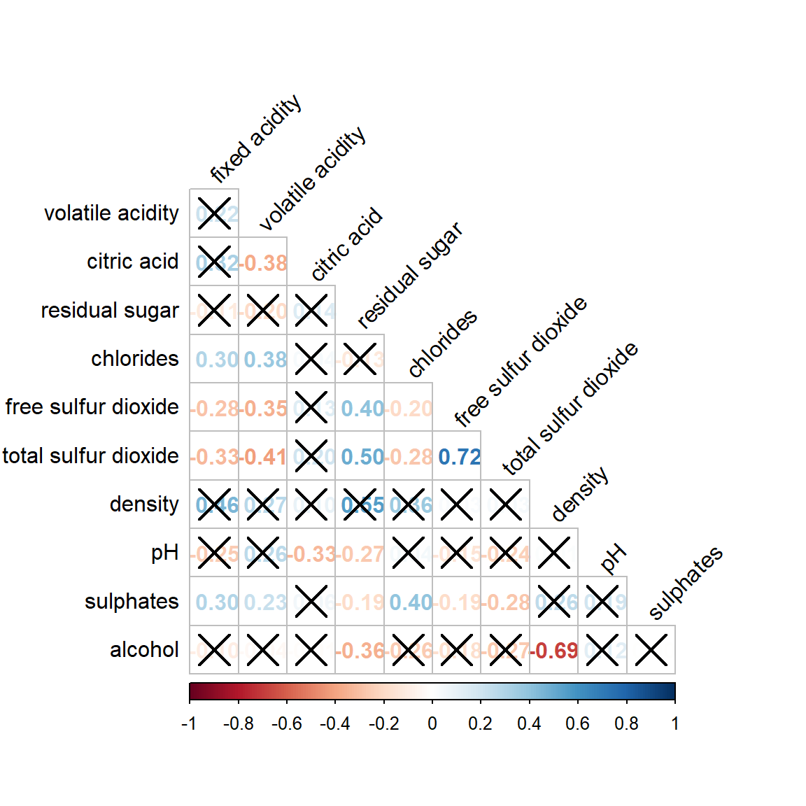

# 1. Creating Ternary Plot with R

## 1.1 Overview

Ternary plots are a way of displaying the distribution and variability of three-part compositional data. (For example, the proportion of aged, economy active and young population or sand, silt, and clay in soil.) It’s display is a triangle with sides scaled from 0 to 1. Each side represents one of the three components. A point is plotted so that a line drawn perpendicular from the point to each leg of the triangle intersect at the component values of the point.

In this hands-on, you will learn how to build ternary plot programmatically using R for visualising and analysing population structure of Singapore.

The hands-on exercise consists of four steps:

-   Install and launch **tidyverse** and **ggtern** packages.

-   Derive three new measures using *mutate()* function of **dplyr** package.

-   Build a static ternary plot using *ggtern()* function of **ggtern** package.

-   Build an interactive ternary plot using *plot-ly()* function of **Plotly R** package.

## 1.2 Installing and launching R packages

For this exercise, two main R packages will be used in this hands-on exercise, they are:

-   [**ggtern**](http://www.ggtern.com/), a ggplot extension specially designed to plot ternary diagrams. The package will be used to plot static ternary plots.

-   [**Plotly R**](https://plot.ly/r/), an R package for creating interactive web-based graphs via plotly’s JavaScript graphing library, plotly.js . The **plotly R** libary contains the *ggplotly* function, which will convert **ggplot2** figures into a Plotly object.

We will also need to ensure that selected **tidyverse** family packages namely: **readr**, **dplyr** and **tidyr** are also installed and loaded.

The code chunks below will accomplish the task.

```{r}
pacman::p_load(plotly, ggtern, tidyverse)
```

## 1.3 Data Preparation

### 1.3.1 The data

For the purpose of this hands-on exercise, the [Singapore Residents by Planning AreaSubzone, Age Group, Sex and Type of Dwelling, June 2000-2018](https://www.singstat.gov.sg/find-data/search-by-theme/population/geographic-distribution/latest-data) data will be used. The data set has been downloaded and included in the data sub-folder of the hands-on exercise folder. It is called *respopagsex2000to2018_tidy.csv* and is in csv file format.

### 1.3.2 Importing Data

To important *respopagsex2000to2018_tidy.csv* into R, ***read_csv()*** function of **readr** package will be used.

```{r}
pacman::p_load(ggdist, ggridges, ggthemes,
#Reading the data into R environment
pop_data <- read_csv("data/respopagsex2000to2018_tidy.csv") 
```

### 1.3.3 Preparing the Data

Next, use the ***mutate()*** function of **dplyr** package to derive three new measures, namely: young, active, and old.

```{r}
#Deriving the young, economy active and old measures
agpop_mutated <- pop_data %>%
  mutate(`Year` = as.character(Year))%>%
  spread(AG, Population) %>%
  mutate(YOUNG = rowSums(.[4:8]))%>%
  mutate(ACTIVE = rowSums(.[9:16]))  %>%
  mutate(OLD = rowSums(.[17:21])) %>%
  mutate(TOTAL = rowSums(.[22:24])) %>%
  filter(Year == 2018)%>%
  filter(TOTAL > 0) 
```

## 1.4 Plotting Ternary Diagram with R

### 1.4.1 Plotting a static ternary diagram

Use ***ggtern()*** function of **ggtern** package to create a simple ternary plot.

```{r}
#Building the static ternary plot
ggtern(data=agpop_mutated,aes(x=YOUNG,y=ACTIVE, z=OLD)) +
  geom_point()
```

```{r}
pacman::p_load(ggdist, ggridges, ggthemes,
#Building the static ternary plot
ggtern(data=agpop_mutated, aes(x=YOUNG,y=ACTIVE, z=OLD)) +
  geom_point() +
  labs(title="Population structure, 2015") +
  theme_rgbw()
```

### 1.4.2 Plotting an interactive ternary diagram

The code below create an interactive ternary plot using ***plot_ly()*** function of **Plotly R**.

```{r}
# reusable function for creating annotation object
label <- function(txt) {
  list(
    text = txt, 
    x = 0.1, y = 1,
    ax = 0, ay = 0,
    xref = "paper", yref = "paper", 
    align = "center",
    font = list(family = "serif", size = 15, color = "white"),
    bgcolor = "#b3b3b3", bordercolor = "black", borderwidth = 2
  )
}

# reusable function for axis formatting
axis <- function(txt) {
  list(
    title = txt, tickformat = ".0%", tickfont = list(size = 10)
  )
}

ternaryAxes <- list(
  aaxis = axis("Young"), 
  baxis = axis("Active"), 
  caxis = axis("Old")
)

# Initiating a plotly visualization 
plot_ly(
  agpop_mutated, 
  a = ~YOUNG, 
  b = ~ACTIVE, 
  c = ~OLD, 
  color = I("black"), 
  type = "scatterternary"
) %>%
  layout(
    annotations = label("Ternary Markers"), 
    ternary = ternaryAxes
  )
```

# 2. Visual Correlation Analysis

## 2.1 Overview

Correlation coefficient is a popular statistic that use to measure the type and strength of the relationship between two variables. The values of a correlation coefficient ranges between -1.0 and 1.0. A correlation coefficient of 1 shows a perfect linear relationship between the two variables, while a -1.0 shows a perfect inverse relationship between the two variables. A correlation coefficient of 0.0 shows no linear relationship between the two variables.

When multivariate data are used, the correlation coefficeints of the pair comparisons are displayed in a table form known as correlation matrix or scatterplot matrix.

There are three broad reasons for computing a correlation matrix.

-   To reveal the relationship between high-dimensional variables pair-wisely.

-   To input into other analyses. For example, people commonly use correlation matrices as inputs for exploratory factor analysis, confirmatory factor analysis, structural equation models, and linear regression when excluding missing values pairwise.

-   As a diagnostic when checking other analyses. For example, with linear regression a high amount of correlations suggests that the linear regression’s estimates will be unreliable.

When the data is large, both in terms of the number of observations and the number of variables, [Corrgram](http://www.datavis.ca/papers/corrgram.pdf) tend to be used to visually explore and analyse the structure and the patterns of relations among variables. It is designed based on two main schemes:

-   Rendering the value of a correlation to depict its sign and magnitude, and

-   Reordering the variables in a correlation matrix so that “similar” variables are positioned adjacently, facilitating perception.

In this hands-on exercise, you will learn how to plot data visualisation for visualising correlation matrix with R. It consists of three main sections. First, you will learn how to create correlation matrix using [*pairs()*](https://www.rdocumentation.org/packages/graphics/versions/3.6.0/topics/pairs) of R Graphics. Next, you will learn how to plot corrgram using **corrplot** package of R. Lastly, you will learn how to create an interactive correlation matrix using plotly R.

## 2.2 Installing and Launching R Packages

Before you get started, you are required to open a new Quarto document. Keep the default html authoring format.

Next, you will use the code chunk below to install and launch **corrplot**, **ggpubr**, **plotly** and **tidyverse** in RStudio.

```{r}
pacman::p_load(corrplot, ggstatsplot, tidyverse)
```

## 2.3 Importing and Preparing The Data Set

In this hands-on exercise, the [Wine Quality Data Set](https://archive.ics.uci.edu/ml/datasets/wine+quality) of UCI Machine Learning Repository will be used. The data set consists of 13 variables and 6497 observations. For the purpose of this exercise, we have combined the red wine and white wine data into one data file. It is called wine_quality and is in csv file format.

### 2.3.1 Importing Data

First, let us import the data into R by using *read_csv()* of **readr** package.

```{r}
wine <- read_csv("data/wine_quality.csv")
```

Notice that beside quality and type, the rest of the variables are numerical and continuous data type.

## 2.4 Building Correlation Matrix: pairs() method

There are more than one way to build scatterplot matrix with R. In this section, you will learn how to create a scatterplot matrix by using the *pairs* function of R Graphics.

Before you continue to the next step, you should read the syntax description of [*pairs*](https://stat.ethz.ch/R-manual/R-devel/library/graphics/html/pairs.html)function.

### 2.4.1 Building a basic correlation matrix

Figure below shows the scatter plot matrix of Wine Quality Data. It is a 11 by 11 matrix.

```{r}
pairs(wine[,1:11])
```

The required input of *pairs()* can be a matrix or data frame. The code chunk used to create the scatterplot matrix is relatively simple. It uses the default *pairs* function. Columns 2 to 12 of wine dataframe is used to build the scatterplot matrix. The variables are: fixed acidity, volatile acidity, citric acid, residual sugar, chlorides, free sulfur dioxide, total sulfur dioxide, density, pH, sulphates and alcohol.

```{r}
pairs(wine[,2:12])
```

### 2.4.2 Drawing the lower corner

*pairs* function of R Graphics provided many customisation arguments. For example, it is a common practice to show either the upper half or lower half of the correlation matrix instead of both. This is because a correlation matrix is symmetric.

To show the lower half of the correlation matrix, the upper.panel argument will be used as shown in the code chunk below.

```{r}
pairs(wine[,2:12], upper.panel = NULL)
```

Similarly, you can display the upper half of the correlation matrix by using the code chun below.

```{r}
pairs(wine[,2:12], lower.panel = NULL)
```

### 2.4.3 Including with correlation coefficients

To show the correlation coefficient of each pair of variables instead of a scatter plot, [*panel.cor*](https://www.rdocumentation.org/packages/xcms/versions/1.48.0/topics/panel.cor) function will be used. This will also show higher correlations in a larger font.

Don’t worry about the details for now-just type this code into your R session or script. Let’s have more fun way to display the correlation matrix.

```{r}
panel.cor <- function(x, y, digits=2, prefix="", cex.cor, ...) {
usr <- par("usr")
on.exit(par(usr))
par(usr = c(0, 1, 0, 1))
r <- abs(cor(x, y, use="complete.obs"))
txt <- format(c(r, 0.123456789), digits=digits)[1]
txt <- paste(prefix, txt, sep="")
if(missing(cex.cor)) cex.cor <- 0.8/strwidth(txt)
text(0.5, 0.5, txt, cex = cex.cor * (1 + r) / 2)
}

pairs(wine[,2:12], 
      upper.panel = panel.cor)
```

## 2.5 Visualizing Correlation Matrix: ggcormat()

One of the major limitation of the correlation matrix is that the scatter plots appear very cluttered when the number of observations is relatively large (i.e. more than 500 observations). To over come this problem, **Corrgram** data visualisation technique suggested by D. J. Murdoch and E. D. Chow (1996) and Friendly, M (2002) and will be used.

The are at least three R packages provide function to plot corrgram, they are:

-   [corrgram](https://cran.r-project.org/web/packages/corrgram/index.html)

-   [ellipse](https://cran.r-project.org/web/packages/ellipse/index.html)

-   [corrplot](https://cran.r-project.org/web/packages/corrplot/index.html)

On top that, some R package like ggstatsplot package also provides functions for building corrgram.

In this section, you will learn how to visualising correlation matrix by using [*ggcorrmat()*](https://indrajeetpatil.github.io/ggstatsplot/reference/ggcorrmat.html) of [**ggstatsplot**](https://indrajeetpatil.github.io/ggstatsplot/index.html) package.

### 2.5.1 The basic plot

On of the advantage of using *ggcorrmat()* over many other methods to visualise a correlation matrix is it’s ability to provide a comprehensive and yet professional statistical report as shown in the figure below.

```{r}
ggstatsplot::ggcorrmat(
  data = wine, 
  cor.vars = 1:11)
```

```{r}
ggstatsplot::ggcorrmat(
  data = wine, 
  cor.vars = 1:11,
  ggcorrplot.args = list(outline.color = "black", 
                         hc.order = TRUE,
                         tl.cex = 10),
  title    = "Correlogram for wine dataset",
  subtitle = "Four pairs are no significant at p < 0.05"
)
```

Things to learn from the code chunk above:

-   `cor.vars` argument is used to compute the correlation matrix needed to build the corrgram.

-   `ggcorrplot.args` argument provide additional (mostly aesthetic) arguments that will be passed to [`ggcorrplot::ggcorrplot`](http://www.sthda.com/english/wiki/ggcorrplot-visualization-of-a-correlation-matrix-using-ggplot2) function. The list should avoid any of the following arguments since they are already internally being used: `corr`, `method`, `p.mat`, `sig.level`, `ggtheme`, `colors`, `lab`, `pch`, `legend.title`, `digits`.

The sample sub-code chunk can be used to control specific component of the plot such as the font size of the x-axis, y-axis, and the statistical report.

```{r}
ggplot.component = list(
    theme(text=element_text(size=5),
      axis.text.x = element_text(size = 8),
      axis.text.y = element_text(size = 8)))
```

## 2.6 Building multiple plots

Since ggstasplot is an extension of ggplot2, it also supports faceting. However the feature is not available in *ggcorrmat()* but in the [*grouped_ggcorrmat()*](https://indrajeetpatil.github.io/ggstatsplot/reference/grouped_ggcorrmat.html) of **ggstatsplot**.

```{r}
grouped_ggcorrmat(
  data = wine,
  cor.vars = 1:11,
  grouping.var = type,
  type = "robust",
  p.adjust.method = "holm",
  plotgrid.args = list(ncol = 2),
  ggcorrplot.args = list(outline.color = "black", 
                         hc.order = TRUE,
                         tl.cex = 10),
  annotation.args = list(
    tag_levels = "a",
    title = "Correlogram for wine dataset",
    subtitle = "The measures are: alcohol, sulphates, fixed acidity, citric acid, chlorides, residual sugar, density, free sulfur dioxide and volatile acidity",
    caption = "Dataset: UCI Machine Learning Repository"
  )
)
```

Things to learn from the code chunk above:

-   to build a facet plot, the only argument needed is `grouping.var`.

-   Behind *group_ggcorrmat()*, **patchwork** package is used to create the multiplot. `plotgrid.args` argument provides a list of additional arguments passed to [*patchwork::wrap_plots*](https://patchwork.data-imaginist.com/reference/wrap_plots.html), except for guides argument which is already separately specified earlier.

-   Likewise, `annotation.args` argument is calling [*plot annotation arguments*](https://patchwork.data-imaginist.com/reference/plot_annotation.html) of patchwork package.

## 2.7 Visualizing Correlation Matrix using corrplot Package

In this hands-on exercise, we will focus on corrplot. However, you are encouraged to explore the other two packages too.

Before getting started, you are required to read [An Introduction to corrplot Package](https://cran.r-project.org/web/packages/corrplot/vignettes/corrplot-intro.html) in order to gain basic understanding of **corrplot** package.

### 2.7.1 Getting started with corrplot

Before we can plot a corrgram using *corrplot()*, we need to compute the correlation matrix of wine data frame.

In the code chunk below, [*cor()*](https://www.rdocumentation.org/packages/stats/versions/3.6.0/topics/cor) of R Stats is used to compute the correlation matrix of wine data frame.

```{r}
wine.cor <- cor(wine[, 1:11])
```

Next, [*corrplot()*](https://www.rdocumentation.org/packages/corrplot/versions/0.2-0/topics/corrplot) is used to plot the corrgram by using all the default setting as shown in the code chunk below.

```{r}
corrplot(wine.cor)
```

Notice that the default visual object used to plot the corrgram is circle. The default layout of the corrgram is a symmetric matrix. The default colour scheme is diverging blue-red. Blue colours are used to represent pair variables with positive correlation coefficients and red colours are used to represent pair variables with negative correlation coefficients. The intensity of the colour or also know as **saturation** is used to represent the strength of the correlation coefficient. Darker colours indicate relatively stronger linear relationship between the paired variables. On the other hand, lighter colours indicates relatively weaker linear relationship.

### 2.7.2 Working with visual geometrics

In **corrplot** package, there are seven visual geometrics (parameter method) can be used to encode the attribute values. They are: circle, square, ellipse, number, shade, color and pie. The default is circle. As shown in the previous section, the default visual geometric of corrplot matrix is circle. However, this default setting can be changed by using the *method* argument as shown in the code chunk below.

```{r}
corrplot(wine.cor, 
         method = "ellipse") 
```

***Feel free to change the method argument to other supported visual geometrics.***

### 2.7.3 Working with layout

*corrplor()* supports three layout types, namely: “full”, “upper” or “lower”. The default is “full” which display full matrix. The default setting can be changed by using the *type* argument of *corrplot()*.

```{r}
corrplot(wine.cor, 
         method = "ellipse", 
         type="lower")
```

The default layout of the corrgram can be further customised. For example, arguments *diag* and *tl.col* are used to turn off the diagonal cells and to change the axis text label colour to black colour respectively as shown in the code chunk and figure below.

```{r}
corrplot(wine.cor, 
         method = "ellipse", 
         type="lower",
         diag = FALSE,
         tl.col = "black")
```

***Please feel free to experiment with other layout design argument such as tl.pos, tl.cex, tl.offset, cl.pos, cl.cex and cl.offset, just to mention a few of them.***

### 2.7.4 Working with mixed layout

With **corrplot** package, it is possible to design corrgram with mixed visual matrix of one half and numerical matrix on the other half. In order to create a coorgram with mixed layout, the [*corrplot.mixed()*](https://www.rdocumentation.org/packages/corrplot/versions/0.84/topics/corrplot.mixed), a wrapped function for mixed visualisation style will be used.

Figure below shows a mixed layout corrgram plotted using wine quality data.

```{r}
corrplot.mixed(wine.cor, 
               lower = "ellipse", 
               upper = "number",
               tl.pos = "lt",
               diag = "l",
               tl.col = "black")
```

The code chunk used to plot the corrgram are shown below.

```{r}
corrplot.mixed(wine.cor, 
               lower = "ellipse", 
               upper = "number",
               tl.pos = "lt",
               diag = "l",
               tl.col = "black")
```

Notice that argument *lower* and *upper* are used to define the visualisation method used. In this case ellipse is used to map the lower half of the corrgram and numerical matrix (i.e. number) is used to map the upper half of the corrgram. The argument *tl.pos*, on the other, is used to specify the placement of the axis label. Lastly, the *diag* argument is used to specify the glyph on the principal diagonal of the corrgram.

### 2.7.5 Combining corrgram with the significant test

In statistical analysis, we are also interested to know which pair of variables their correlation coefficients are statistically significant.

Figure below shows a corrgram combined with the significant test. The corrgram reveals that not all correlation pairs are statistically significant. For example the correlation between total sulfur dioxide and free surfur dioxide is statistically significant at significant level of 0.1 but not the pair between total sulfur dioxide and citric acid.

{width="522"}

With corrplot package, we can use the *cor.mtest()* to compute the p-values and confidence interval for each pair of variables.

```{r}
wine.sig = cor.mtest(wine.cor, conf.level= .95)
```

We can then use the *p.mat* argument of *corrplot* function as shown in the code chunk below.

```{r}
corrplot(wine.cor,
         method = "number",
         type = "lower",
         diag = FALSE,
         tl.col = "black",
         tl.srt = 45,
         p.mat = wine.sig$p,
         sig.level = .05)
```

### 2.7.6 Reorder a corrgram

Matrix reorder is very important for mining the hiden structure and pattern in a corrgram. By default, the order of attributes of a corrgram is sorted according to the correlation matrix (i.e. “original”). The default setting can be over-write by using the *order* argument of *corrplot()*. Currently, **corrplot** package support four sorting methods, they are:

-   “AOE” is for the angular order of the eigenvectors. See Michael Friendly (2002) for details.

-   “FPC” for the first principal component order.

-   “hclust” for hierarchical clustering order, and “hclust.method” for the agglomeration method to be used.

    -   “hclust.method” should be one of “ward”, “single”, “complete”, “average”, “mcquitty”, “median” or “centroid”.

-   “alphabet” for alphabetical order.

“AOE”, “FPC”, “hclust”, “alphabet”. More algorithms can be found in **seriation** package.

```{r}
corrplot.mixed(wine.cor, 
               lower = "ellipse", 
               upper = "number",
               tl.pos = "lt",
               diag = "l",
               order="AOE",
               tl.col = "black")
```

### 2.7.7 Reordering a correlation matrix using hclust

If using **hclust**, ***corrplot()*** can draw rectangles around the corrgram based on the results of hierarchical clustering.

```{r}
corrplot(wine.cor, 
         method = "ellipse", 
         tl.pos = "lt",
         tl.col = "black",
         order="hclust",
         hclust.method = "ward.D",
         addrect = 3)
```

# 3. Heatmap for Visualizing and Analysing Multivariate Data

## 3.1 Overview

Heatmaps visualise data through variations in colouring. When applied to a tabular format, heatmaps are useful for cross-examining multivariate data, through placing variables in the columns and observation (or records) in rowa and colouring the cells within the table. Heatmaps are good for showing variance across multiple variables, revealing any patterns, displaying whether any variables are similar to each other, and for detecting if any correlations exist in-between them.

In this hands-on exercise, you will gain hands-on experience on using R to plot static and interactive heatmap for visualising and analysing multivariate data.

## 3.2 Installing and Launching R Packages

Before you get started, you are required to open a new Quarto document. Keep the default html as the authoring format.

Next, you will use the code chunk below to install and launch **seriation**, **heatmaply**, **dendextend** and **tidyverse** in RStudio.

```{r}
pacman::p_load(seriation, dendextend, heatmaply, tidyverse)
```

## 3.3 Importing and Preparing The Data Set

In this hands-on exercise, the data of [World Happines 2018 report](https://worldhappiness.report/ed/2018/) will be used. The data set is downloaded from [here](https://s3.amazonaws.com/happiness-report/2018/WHR2018Chapter2OnlineData.xls). The original data set is in Microsoft Excel format. It has been extracted and saved in csv file called **WHData-2018.csv**.

### 3.3.1 Importing the data set

In the code chunk below, **read_csv()** of *readr* is used to import WHData-2018.csv into R and parsed it into tibble R data frame format.

```{r}
wh <- read_csv("data/WHData-2018.csv")
```

The output tibbled data frame is called **wh**.

### 3.3.2 Preparing the data

Next, we need to change the rows by country name instead of row number by using the code chunk below.

```{r}
row.names(wh) <- wh$Country
```

Notice that the row number has been replaced into the country name.

### 3.3.3 Transforming the data frame into a matrix

The data was loaded into a data frame, but it has to be a data matrix to make your heatmap.

The code chunk below will be used to transform *wh* data frame into a data matrix.

```{r}
wh1 <- dplyr::select(wh, c(3, 7:12))
wh_matrix <- data.matrix(wh)
```

Notice that **wh_matrix** is in R matrix format.

## 3.4 Static Heatmap

There are many R packages and functions can be used to drawing static heatmaps, they are:

-   [heatmap()](https://www.rdocumentation.org/packages/stats/versions/3.6.0/topics/heatmap)of R stats package. It draws a simple heatmap.

-   [heatmap.2()](https://www.rdocumentation.org/packages/gplots/versions/3.0.1.1/topics/heatmap.2) of **gplots** R package. It draws an enhanced heatmap compared to the R base function.

-   [pheatmap()](https://www.rdocumentation.org/packages/pheatmap/versions/1.0.12/topics/pheatmap) of [**pheatmap**](https://www.rdocumentation.org/packages/pheatmap/versions/1.0.12) R package. **pheatmap** package also known as Pretty Heatmap. The package provides functions to draws pretty heatmaps and provides more control to change the appearance of heatmaps.

-   [**ComplexHeatmap**](https://bioconductor.org/packages/release/bioc/html/ComplexHeatmap.html) package of R/Bioconductor package. The package draws, annotates and arranges complex heatmaps (very useful for genomic data analysis). The full reference guide of the package is available [here](https://jokergoo.github.io/ComplexHeatmap-reference/book/).

-   [**superheat**](https://cran.r-project.org/web/packages/superheat/) package: A Graphical Tool for Exploring Complex Datasets Using Heatmaps. A system for generating extendable and customizable heatmaps for exploring complex datasets, including big data and data with multiple data types. The full reference guide of the package is available [here](https://rlbarter.github.io/superheat/).

In this section, you will learn how to plot static heatmaps by using **heatmap()** of *R Stats* package.

### 3.4.1 heatmap() of R Stats

In this sub-section, we will plot a heatmap by using *heatmap()* of Base Stats. The code chunk is given below.

```{r}
wh_heatmap <- heatmap(wh_matrix,
                      Rowv=NA, Colv=NA)
```

> **Note**
>
> -   By default, heatmap() plots a cluster heatmap. The arguments Rowv=NA and Colv=NA are used to switch off the option of plotting the row and column dendrograms.

To plot a cluster heatmap, we just have to use the default as shown in the code chunk below.

```{r}
wh_heatmap <- heatmap(wh_matrix)
```

> **Note**
>
> -   The order of both rows and columns is different compare to the native wh_matrix. This is because heatmap do a reordering using clusterisation: it calculates the distance between each pair of rows and columns and try to order them by similarity. Moreover, the corresponding dendrogram are provided beside the heatmap.

Here, red cells denotes small values, and red small ones. This heatmap is not really informative. Indeed, the Happiness Score variable have relatively higher values, what makes that the other variables with small values all look the same. Thus, we need to normalize this matrix. This is done using the scale argument. It can be applied to rows or to columns following your needs.

The code chunk below normalises the matrix column-wise.

```{r}
wh_heatmap <- heatmap(wh_matrix,
                      scale="column",
                      cexRow = 0.6, 
                      cexCol = 0.8,
                      margins = c(10, 4))
```

Notice that the values are scaled now. Also note that margins argument is used to ensure that the entire x-axis labels are displayed completely and, cexRow and cexCol arguments are used to define the font size used for y-axis and x-axis labels respectively.

## 3.5 Creating Interactive Heatmap

heatmaply is an R package for building interactive cluster heatmap that can be shared online as a stand-alone HTML file. It is designed and maintained by Tal Galili.

Before we get started, you should review the Introduction to Heatmaply to have an overall understanding of the features and functions of Heatmaply package. You are also required to have the user manualof the package handy with you for reference purposes.

In this section, you will gain hands-on experience on using heatmaply to design an interactive cluster heatmap. We will still use the wh_matrix as the input data.

### 3.5.1 Working with heatmaply

```{r}
heatmaply(mtcars)
```

The code chunk below shows the basic syntax needed to create n interactive heatmap by using heatmaply package.

```{r}
heatmaply(wh_matrix[, -c(1, 2, 4, 5)])
```

Note that:

Different from heatmap(), for heatmaply() the default horizontal dendrogram is placed on the left hand side of the heatmap. The text label of each raw, on the other hand, is placed on the right hand side of the heat map. When the x-axis marker labels are too long, they will be rotated by 135 degree from the north.

### 3.5.2 Data transformation

When analysing multivariate data set, it is very common that the variables in the data sets includes values that reflect different types of measurement. In general, these variables’ values have their own range. In order to ensure that all the variables have comparable values, data transformation are commonly used before clustering.

Three main data transformation methods are supported by heatmaply(), namely: scale, normalise and percentilse.

#### 3.5.2.1 Scaling method

-   When all variables are came from or assumed to come from some normal distribution, then scaling (i.e.: subtract the mean and divide by the standard deviation) would bring them all close to the standard normal distribution.

-   In such a case, each value would reflect the distance from the mean in units of standard deviation.

-   The *scale* argument in *heatmaply()* supports column and row scaling.

The code chunk below is used to scale variable values columewise.

```{r}
heatmaply(wh_matrix[, -c(1, 2, 4, 5)],
          scale = "column")
```

#### 3.5.2.2 Normalising method

-   When variables in the data comes from possibly different (and non-normal) distributions, the normalize function can be used to bring data to the 0 to 1 scale by subtracting the minimum and dividing by the maximum of all observations.

-   This preserves the shape of each variable’s distribution while making them easily comparable on the same “scale”.

Different from Scaling, the normalise method is performed on the input data set i.e. wh_matrix as shown in the code chunk below.

```{r}
heatmaply(normalize(wh_matrix[, -c(1, 2, 4, 5)]))
```

#### 3.5.2.3 Percentising method

-   This is similar to ranking the variables, but instead of keeping the rank values, divide them by the maximal rank.

-   This is done by using the ecdf of the variables on their own values, bringing each value to its empirical percentile.

-   The benefit of the percentize function is that each value has a relatively clear interpretation, it is the percent of observations that got that value or below it.

Similar to Normalize method, the Percentize method is also performed on the input data set i.e. wh_matrix as shown in the code chunk below.

```{r}
heatmaply(percentize(wh_matrix[, -c(1, 2, 4, 5)]))
```

### 3.5.3 Clustering algorithm

**heatmaply** supports a variety of hierarchical clustering algorithm. The main arguments provided are:

-   *distfun*: function used to compute the distance (dissimilarity) between both rows and columns. Defaults to dist. The options “pearson”, “spearman” and “kendall” can be used to use correlation-based clustering, which uses as.dist(1 - cor(t(x))) as the distance metric (using the specified correlation method).

-   *hclustfun*: function used to compute the hierarchical clustering when *Rowv* or *Colv* are not dendrograms. Defaults to *hclust*.

-   *dist_method* default is NULL, which results in “euclidean” to be used. It can accept alternative character strings indicating the method to be passed to distfun. By default *distfun* is “dist”” hence this can be one of “euclidean”, “maximum”, “manhattan”, “canberra”, “binary” or “minkowski”.

-   *hclust_method* default is NULL, which results in “complete” method to be used. It can accept alternative character strings indicating the method to be passed to *hclustfun*. By default hclustfun is hclust hence this can be one of “ward.D”, “ward.D2”, “single”, “complete”, “average” (= UPGMA), “mcquitty” (= WPGMA), “median” (= WPGMC) or “centroid” (= UPGMC).

In general, a clustering model can be calibrated either manually or statistically.

### 3.5.4 Manual approach

In the code chunk below, the heatmap is plotted by using hierachical clustering algorithm with “Euclidean distance” and “ward.D” method.

```{r}
wh_d <- dist(normalize(wh_matrix[, -c(1, 2, 4, 5)]), method = "euclidean")
dend_expend(wh_d)[[3]]
```

### 3.5.5 Statistical approach

In order to determine the best clustering method and number of cluster the *dend_expend()* and *find_k()* functions of **dendextend** package will be used.

First, the *dend_expend()* will be used to determine the recommended clustering method to be used.

```{r}
wh_d <- dist(normalize(wh_matrix[, -c(1, 2, 4, 5)]), method = "euclidean")
dend_expend(wh_d)[[3]]
```

The output table shows that “average” method should be used because it gave the high optimum value.

Next, *find_k()* is used to determine the optimal number of cluster.

```{r}
wh_clust <- hclust(wh_d, method = "average")
num_k <- find_k(wh_clust)
plot(num_k)
```

Figure above shows that k=3 would be good.

With reference to the statistical analysis results, we can prepare the code chunk as shown below.

```{r}
heatmaply(normalize(wh_matrix[, -c(1, 2, 4, 5)]),
          dist_method = "euclidean",
          hclust_method = "average",
          k_row = 3)
```

### 3.5.6 Seriation

One of the problems with hierarchical clustering is that it doesn’t actually place the rows in a definite order, it merely constrains the space of possible orderings. Take three items A, B and C. If you ignore reflections, there are three possible orderings: ABC, ACB, BAC. If clustering them gives you ((A+B)+C) as a tree, you know that C can’t end up between A and B, but it doesn’t tell you which way to flip the A+B cluster. It doesn’t tell you if the ABC ordering will lead to a clearer-looking heatmap than the BAC ordering.

**heatmaply** uses the seriation package to find an optimal ordering of rows and columns. Optimal means to optimize the Hamiltonian path length that is restricted by the dendrogram structure. This, in other words, means to rotate the branches so that the sum of distances between each adjacent leaf (label) will be minimized. This is related to a restricted version of the travelling salesman problem.

Here we meet our first seriation algorithm: Optimal Leaf Ordering (OLO). This algorithm starts with the output of an agglomerative clustering algorithm and produces a unique ordering, one that flips the various branches of the dendrogram around so as to minimize the sum of dissimilarities between adjacent leaves. Here is the result of applying Optimal Leaf Ordering to the same clustering result as the heatmap above.

```{r}
heatmaply(normalize(wh_matrix[, -c(1, 2, 4, 5)]),
          seriate = "OLO")
```

The default options is “OLO” (Optimal leaf ordering) which optimizes the above criterion (in O(n\^4)). Another option is “GW” (Gruvaeus and Wainer) which aims for the same goal but uses a potentially faster heuristic.

```{r}
heatmaply(normalize(wh_matrix[, -c(1, 2, 4, 5)]),
          seriate = "GW")
```

The option “mean” gives the output we would get by default from heatmap functions in other packages such as gplots::heatmap.2.

```{r}
heatmaply(normalize(wh_matrix[, -c(1, 2, 4, 5)]),
          seriate = "mean")
```

The option “none” gives us the dendrograms without any rotation that is based on the data matrix.

```{r}
heatmaply(normalize(wh_matrix[, -c(1, 2, 4, 5)]),
          seriate = "none")
```

### 3.5.7 Working with colour palettes

The default colour palette uses by **heatmaply** is *viridis*. heatmaply users, however, can use other colour palettes in order to improve the aestheticness and visual friendliness of the heatmap.

In the code chunk below, the Blues colour palette of rColorBrewer is used

```{r}
heatmaply(normalize(wh_matrix[, -c(1, 2, 4, 5)]),
          seriate = "none",
          colors = Blues)
```

### 3.5.8 The finishing touch

Beside providing a wide collection of arguments for meeting the statistical analysis needs, *heatmaply* also provides many plotting features to ensure cartographic quality heatmap can be produced.

In the code chunk below the following arguments are used:

-   *k_row* is used to produce 5 groups.

-   *margins* is used to change the top margin to 60 and row margin to 200.

-   *fontsizw_row* and *fontsize_col* are used to change the font size for row and column labels to 4.

-   *main* is used to write the main title of the plot.

-   *xlab* and *ylab* are used to write the x-axis and y-axis labels respectively.

```{r}
heatmaply(normalize(wh_matrix[, -c(1, 2, 4, 5)]),
          Colv=NA,
          seriate = "none",
          colors = Blues,
          k_row = 5,
          margins = c(NA,200,60,NA),
          fontsize_row = 4,
          fontsize_col = 5,
          main="World Happiness Score and Variables by Country, 2018 \nDataTransformation using Normalise Method",
          xlab = "World Happiness Indicators",
          ylab = "World Countries"
          )
```
